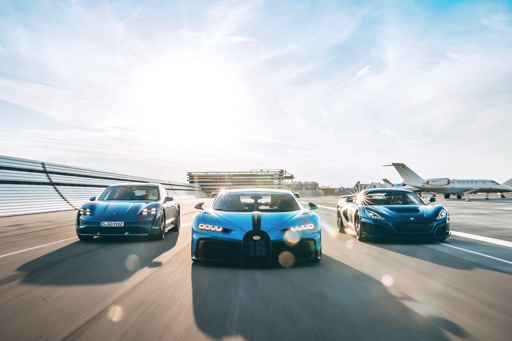

# Rimac-komunikacija

## Komunikacijska strategija Mate Rimca (u razdoblju preuzimanja Bugattija)

  

 
Uzorak:

 

Sve javno dostupne objave (42 422) na društvenim medijima u razdoblju od 01. srpnja do 16. srpnja 2021. godine koje u sebi sadrže pojam "rimac" i "nevera".

Podatci su dostupni u [repozitoriju](https://github.com/lusiki/Rimac-komunikacija/tree/main/dta) u .csv i .xlsx formatu.
 

 

Rezultati analize su dostupni za medije:
 
 

[Skupni pregled](https://raw.githack.com/lusiki/Rimac-komunikacija/main/code/GENERAL.html)
 

- u prvom planu je tvrtka Rimac (po broju objava i sadržaju)

- imidž kompanije je vezan uz vlasnika (M.Rimac), Hrvatsku, razvoj u automoto industiji, a sve drugo je sekundarno (npr.Bugatti, Porsche)

- najviše aktivnosti na modernim društvenim medijima i forumima (besplatna promidžba kao komunikacijska strategija?)

- malo originalnih (od strane tvrtke) objava u "tradicionalnim" medijima

[Facebook](https://raw.githack.com/lusiki/Rimac-komunikacija/main/code/facebook.html)
 

- najvažniji medij 

- Rimac Automobili objave jako važne (pogledaj)  

- pogledati profile koji su bitni i što objavljuju

[Forums](https://raw.githack.com/lusiki/Rimac-komunikacija/main/code/forums.html)
 

- izraito važan medij
 
- Index Forum najbiniji

[Portals](https://raw.githack.com/lusiki/Rimac-komunikacija/main/code/portals.html)
 

[Twitter](https://raw.githack.com/lusiki/Rimac-komunikacija/main/code/twitter.html)
 

[Youtube](https://raw.githack.com/lusiki/Rimac-komunikacija/main/code/YouTube.html)
 

[Press](https://raw.githack.com/lusiki/Rimac-komunikacija/main/code/press.html)
 

[Instagram](https://raw.githack.com/lusiki/Rimac-komunikacija/main/code/Instagram.html)